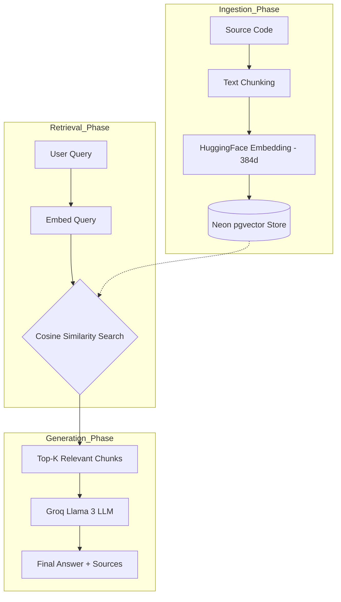

# DevDocs RAG 🚀

An AI-powered documentation assistant that uses RAG (Retrieval-Augmented Generation) to answer questions about a GitHub repository's source code.

## 🛠️ Tech Stack

- **Frontend:** Next.js, Tailwind CSS
- **Backend:** FastAPI (Python)
- **AI/LLM:** Groq (Llama 3), HuggingFace Inference API (Embeddings)
- **Database:** Neon (PostgreSQL) with `pgvector`
- **Orchestration:** LangChain

## 🏗️ Architecture

1. **Ingestion:** The backend clones a repo, chunks the code, generates embeddings via HuggingFace, and stores them in Neon.
2. **Retrieval:** When a user asks a question, the system finds relevant code snippets using vector similarity search.
3. **Generation:** Groq processes the question and the retrieved code to provide an accurate technical answer.



## 🚀 Local Setup

### 1. Backend

1. Navigate to `/backend`.
2. Create a virtual environment: `python -m venv venv`.
3. Activate venv: `source venv/bin/activate` (or `venv\Scripts\activate` on Windows).
4. Install dependencies: `pip install -r requirements.txt`.
5. Create a `.env` file based on `.env.example` and add your keys.
6. Run the server: `uvicorn main:app --reload`.

### 2. Frontend

1. Navigate to `/frontend`.
2. Install dependencies: `npm install`.
3. Create a `.env.local` file based on `.env.example`.
4. Run the app: `npm run dev`.

## 🌐 Deployment

- **Backend:** Hosted on Render.
- **Frontend:** Hosted on Vercel.
- **Database:** Managed by Neon.

```

```
