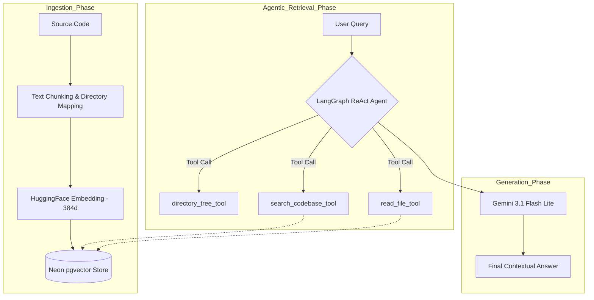

# DevDocs RAG 🚀

An AI-powered documentation assistant that uses RAG (Retrieval-Augmented Generation) to answer questions about a GitHub repository's source code.

## 🛠️ Tech Stack

- **Frontend:** Next.js, Tailwind CSS
- **Backend:** FastAPI (Python)
- **AI/LLM:** Google GenAI (Gemini 3.1 Flash Lite), HuggingFace Inference API (Embeddings)
- **Database:** Neon (PostgreSQL) with `pgvector`
- **Orchestration:** LangChain & LangGraph (Agentic Workflow)

## 🏗️ Architecture (Agentic RAG)

1. **Ingestion:** The backend clones a repo, generates a directory tree map, chunks the code, generates embeddings via HuggingFace, and stores them in Neon.
2. **Reasoning:** When a user asks a question, a LangGraph ReAct agent parses the intent and decides which tools to use.
3. **Tool Execution:** The agent dynamically uses `directory_tree_tool`, `search_codebase_tool`, and `read_file_tool` to explore the codebase.
4. **Generation:** Gemini synthesizes the tool outputs to provide an accurate, highly contextualized technical answer.



## 🚀 Local Setup

### 1. Backend

1. Navigate to `/backend`.
2. Create a virtual environment: `python -m venv venv`.
3. Activate venv: `source venv/bin/activate` (or `venv\Scripts\activate` on Windows).
4. Install dependencies: `pip install -r requirements.txt`.
5. Create a `.env` file based on `.env.example` and add your keys.
6. Run the server: `uvicorn main:app --reload`.

### 2. Frontend

1. Navigate to `/frontend`.
2. Install dependencies: `npm install`.
3. Create a `.env.local` file based on `.env.example`.
4. Run the app: `npm run dev`.

## 🌐 Deployment

- **Backend:** Hosted on Render.
- **Frontend:** Hosted on Vercel.
- **Database:** Managed by Neon.

## 🧪 Testing

The backend includes a suite of automated tests using `pytest`.

### Unit Tests
To run the standard tests:
1. Ensure your virtual environment is active.
2. Run `pytest` in the `/backend` directory:
```bash
cd backend
pytest -v
```

### RAG Evaluation (DeepEval)
We use **DeepEval** to quantitatively evaluate the Agentic RAG performance.

We evaluate the system on two main metrics:
- **Faithfulness (No Hallucinations):** Ensures the generated answer is strictly derived from the retrieved GitHub codebase context.
- **Answer Relevancy:** Ensures the generated answer directly addresses the user's question without unnecessary tangents.

The evaluation process leverages our own `GeminiJudge` (powered by Google GenAI Gemini 3.1 Flash Lite) to act as an impartial LLM judge, grading the RAG pipeline automatically on various parameterized test cases (e.g. asking about frontend architecture, database usage, and folder structures).

To run the RAG evaluation tests:
```bash
deepeval test run tests/test_rag_evaluation.py
```
